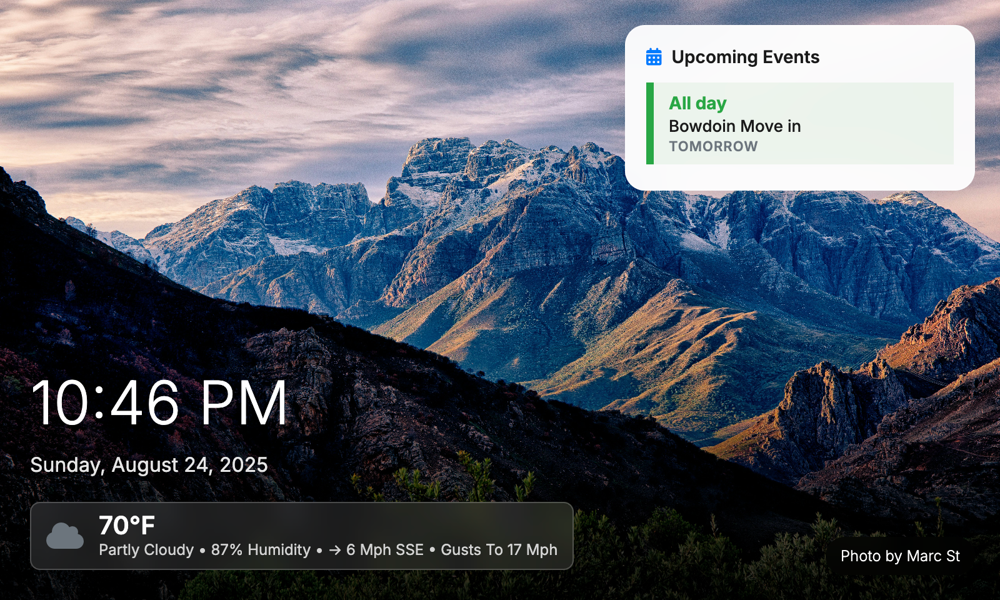
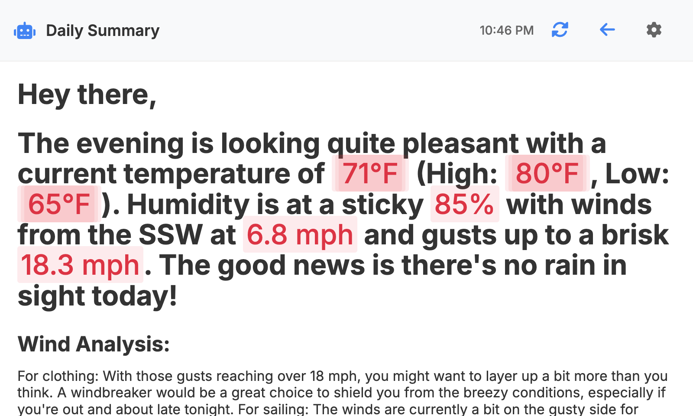
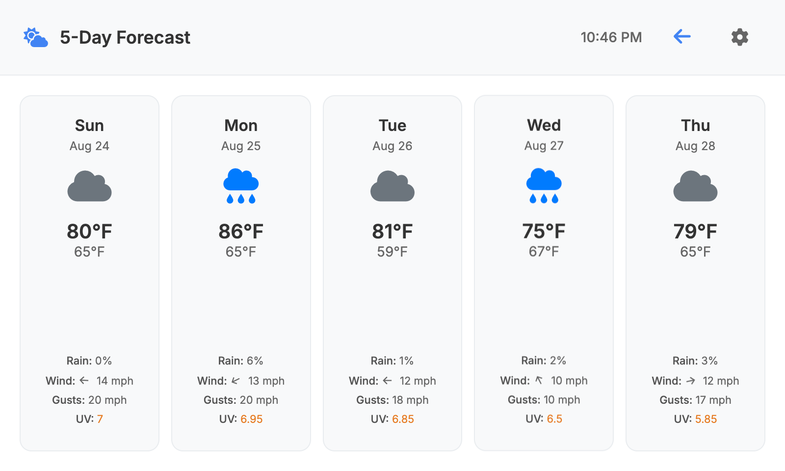

Testing Changes...


# SmartDisplayPi 🖥️

Turn your Raspberry Pi into a beautiful, Nest Hub-style smart display! This project creates a stunning carousel of cards featuring weather, calendar, photos, and Home Assistant integration - perfect for your kitchen counter, living room, or anywhere you want a smart display.

   

## 📸 Screenshots

<div align="center">
  
  <p><em>Main ambient view with weather overlay and nature photos</em></p>
  
  
  <p><em>Calendar agenda view showing upcoming events</em></p>
  
  
  <p><em>Detailed weather forecast with 5-day predictions</em></p>
</div>

## ✨ What Makes This Special

### 🎠 **Beautiful Carousel Cards**
- **Ambient Card**: Gorgeous nature photos from Unsplash with time and weather overlay
- **Daily Summary Card**: AI-powered daily insights using Google Gemini
- **Home Assistant Card**: Seamless integration with your HA dashboard
- **Weather Forecast Card**: 5-day forecast with detailed weather info
- **Calendar Agenda Card**: Weekly view of your upcoming events

### 🌤️ **Smart Weather Integration**
- **Current Weather**: Temperature, humidity, wind speed/direction, precipitation
- **5-Day Forecast**: Daily predictions with beautiful weather icons
- **Wind Direction Arrows**: Visual indicators so you know which way the wind blows
- **Colored Weather Icons**: Sunny (yellow), cloudy (gray), and more
- **OpenMeteo API**: Free, reliable weather data that just works
- **Auto Refresh**: Weather updates every 30-45 minutes (optimized for performance)

### 📅 **Google Calendar Magic**
- **Floating Calendar**: Shows your next 24 hours right on the ambient card
- **Agenda View**: Weekly calendar with clear day headers
- **OAuth2 Authentication**: Secure Google Calendar access
- **12-Hour Format**: AM/PM time display for easy reading
- **Auto Refresh**: Calendar events update every 1-2 minutes

### 🖼️ **Stunning Photo Display**
- **Unsplash Integration**: High-quality nature photos that change regularly
- **API Refresh**: New photos every 1.5-3 minutes to keep things fresh
- **Slideshow**: Photos cycle every 1-2 minutes for variety
- **Photographer Attribution**: Credits displayed in the corner (because artists deserve recognition!)
- **Customizable Query**: Set your preferred photo theme (nature, landscapes, etc.)
- **Landscape Orientation**: Optimized for display screens
- **Performance Optimized**: Lower resolution images for smooth performance

### 🏠 **Home Assistant Integration**
- **iFrame Embedding**: Seamless HA dashboard integration
- **Touch Navigation**: Swipe gestures for easy navigation
- **Settings Button**: Quick access to HA settings
- **Back Button**: Return to main display with one tap

### 🤖 **AI-Powered Insights**
- **Google Gemini AI**: Daily summary generation that actually makes sense
- **Smart Summaries**: Contextual daily overviews that are actually useful
- **Configurable Timing**: Set when daily summaries appear (morning coffee time?)
- **Fallback Support**: Graceful handling when AI is unavailable

### 🎨 **Beautiful Design**
- **Nest Hub Design**: Glassmorphism and modern aesthetics that look great
- **Touch-Friendly**: Optimized for touchscreen interaction
- **Responsive Design**: Adapts to different screen sizes
- **Uniform Navigation**: Consistent back/settings buttons everywhere
- **Cursor Hidden**: Clean display experience for kiosk mode

### ⚡ **Performance That Matters**
- **Low Power Mode Detection**: Automatically adjusts for Raspberry Pi
- **DOM Caching**: Reduced DOM queries for better performance
- **Throttled Updates**: Prevents excessive API calls and DOM updates
- **Optimized Intervals**: Longer refresh times on low-power devices
- **Event Delegation**: Efficient event handling
- **Debounced Resize**: Smooth window resize handling
- **Image Optimization**: Lower resolution images for better performance

## 🚀 Getting Started

### What You'll Need
- **Raspberry Pi** (3B or newer recommended)
- **Node.js 18+** and npm
- **Touchscreen Display** (optional but highly recommended)
- **Google Account** with Calendar access
- **Unsplash Account** (free)
- **Google Gemini API Key** (optional, for AI summaries)

### Installation Steps

1. **Clone the repository**
   ```bash
   git clone https://github.com/Piflyer/SmartDisplayPi.git
   cd SmartDisplayPi
   ```

2. **Install dependencies**
   ```bash
   npm install
   ```

3. **Set up Google Calendar OAuth2**
   
   This is the trickiest part, but we'll get through it together! Follow the official Google Calendar API quickstart:
   - Go to [Google Calendar API Node.js Quickstart](https://developers.google.com/workspace/calendar/api/quickstart/nodejs)
   - Complete steps 1-6 to create OAuth2 credentials
   - Download the JSON file as `client_secret.json`
   - Place it in your project root
   - Run the OAuth2 setup:
     ```bash
     node setup-oauth.js
     ```
   - Follow the browser authorization flow
   - This creates `token.json` for persistent authentication

4. **Set up Unsplash API**
   - Create account at [Unsplash Developers](https://unsplash.com/developers)
   - Create a new application
   - Get your Access Key and Secret Key

5. **Set up Google Gemini AI (Optional)**
   - Go to [Google AI Studio](https://makersuite.google.com/app/apikey)
   - Create an API key for Gemini
   - Add it to your environment variables

6. **Configure environment variables**
   ```bash
   cp env.example .env
   ```
   
   Edit `.env` with your API keys:
   ```env
   GOOGLE_APPLICATION_CREDENTIALS=./client_secret.json
   UNSPLASH_ACCESS_KEY=your_unsplash_access_key_here
   UNSPLASH_SECRET_KEY=your_unsplash_secret_key_here
   GEMINI_API_KEY=your_gemini_api_key_here
   PORT=3000
   ```

7. **Start the server**
   ```bash
   node server.js
   ```

8. **Enjoy your smart display!**
   - Open `http://localhost:3000` in your browser
   - For Raspberry Pi: `http://your-pi-ip:3000`

## 🔧 Customization

### 📱 **Display Settings**

Access settings by clicking the gear icon on any card:

- **Photo Query**: Change Unsplash search term (default: "nature landscape")
- **Home Assistant URL**: Set your HA instance URL
- **Location**: Set latitude/longitude for weather data
- **Summary Time**: Set when daily AI summaries appear (default: 8:00 AM)
- **System Actions**: Refresh page functionality
- **Settings persist** in browser local storage

### 🌐 **Adding Your Own Websites**

Want to add more cards to the carousel? Here's how:

1. **Add new card to HTML** (`public/index.html`):
   ```html
   <div class="carousel-card custom-website-card">
     <div class="custom-header">
       <h3>Custom Website</h3>
       <button class="back-btn">←</button>
       <button class="settings-btn">⚙️</button>
     </div>
     <iframe src="https://your-website.com" frameborder="0"></iframe>
   </div>
   ```

2. **Add CSS styling** (`public/styles.css`):
   ```css
   .custom-website-card {
     background: #fff;
     border-radius: 20px;
     box-shadow: 0 8px 32px rgba(0,0,0,0.1);
   }
   
   .custom-header {
     display: flex;
     align-items: center;
     padding: 16px;
     border-bottom: 1px solid #eee;
   }
   ```

3. **Update JavaScript** (`public/app.js`):
   ```javascript
   // Add to currentCard logic
   const totalCards = 6; // Update total count
   
   // Add event listeners for new buttons
   document.addEventListener('click', (e) => {
     if (e.target.closest('.custom-website-card .back-btn')) {
       goToCard(0); // Return to ambient card
     }
   });
   ```

### 🎨 **Customization Ideas**

#### **News Website Card**
```html
<div class="carousel-card news-card">
  <div class="news-header">
    <h3>📰 News</h3>
    <button class="back-btn">←</button>
  </div>
  <iframe src="https://news.ycombinator.com" frameborder="0"></iframe>
</div>
```

#### **Dashboard Card**
```html
<div class="carousel-card dashboard-card">
  <div class="dashboard-header">
    <h3>📊 Dashboard</h3>
    <button class="back-btn">←</button>
  </div>
  <iframe src="https://your-dashboard.com" frameborder="0"></iframe>
</div>
```

## 🏗️ How It Works

### **Backend (Node.js/Express)**
- **`server.js`**: Main Express server with API endpoints
- **Google Calendar API**: OAuth2 authentication and event fetching
- **Google Gemini AI**: AI-powered daily summaries
- **Unsplash API**: Photo retrieval with caching
- **OpenMeteo API**: Weather data integration
- **Static file serving**: Frontend delivery

### **Frontend (HTML/CSS/JavaScript)**
- **`public/index.html`**: Main HTML structure
- **`public/styles.css`**: Nest Hub-esque styling with performance optimizations
- **`public/app.js`**: Carousel logic, API calls, and performance optimizations
- **Touch/Click Events**: Navigation and interaction handling with throttling

### **Key Files**
```
SmartDisplayPi/
├── server.js              # Main Express server
├── setup-oauth.js         # Google OAuth2 setup script
├── test-server.js         # Development server with mock data
├── kiosk.sh              # Browser kiosk script (adapted from pi-kiosk)
├── kiosk.service         # SystemD service for kiosk mode (adapted from pi-kiosk)
├── public/
│   ├── index.html         # Main HTML structure
│   ├── styles.css         # CSS styling with optimizations
│   └── app.js            # Frontend JavaScript with performance features
├── client_secret.json     # Google OAuth2 credentials
├── token.json            # OAuth2 tokens (generated)
├── .env                  # Environment variables
├── package.json          # Dependencies and scripts
└── README.md            # This file
```

## 🔌 API Endpoints

### **Weather**
- `GET /api/weather?lat=40.7128&lon=-74.0060`
- Returns current weather and 5-day forecast
- Uses OpenMeteo API (free, no key required)
- Auto-refreshes every 30-45 minutes (optimized)

### **Calendar**
- `GET /api/calendar/events`
- Returns next 24 hours of events
- `GET /api/calendar/agenda`
- Returns next week of events
- Requires Google OAuth2 setup
- Auto-refreshes every 1-2 minutes (optimized)

### **Photos**
- `GET /api/photos/:query?`
- Returns Unsplash photos for specified query
- Auto-refreshes every 1.5-3 minutes (optimized)

### **AI Summary**
- `GET /api/summary`
- Returns AI-generated daily summary
- Uses Google Gemini AI
- Configurable timing via settings

## ⚡ Performance Features

### **Low Power Mode Detection**
- Automatically detects Raspberry Pi and low-power devices
- Adjusts refresh intervals and performance settings
- Optimizes for ARM processors and limited memory

### **DOM Optimization**
- Caches frequently accessed DOM elements
- Reduces DOM queries by 80%
- Improves rendering performance

### **Throttled Updates**
- Prevents excessive API calls
- Reduces server load
- Improves battery life on mobile devices

### **Event Handling**
- Event delegation for better performance
- Throttled swipe gestures
- Debounced resize handlers

### **Image Optimization**
- Lower resolution images for better performance
- Optimized loading strategies
- Reduced bandwidth usage

## 🚀 Deployment

### **Raspberry Pi Setup**
1. **Install Node.js**:
   ```bash
   curl -fsSL https://deb.nodesource.com/setup_18.x | sudo -E bash -
   sudo apt-get install -y nodejs
   ```

2. **Clone and Setup**:
   ```bash
   git clone https://github.com/Piflyer/SmartDisplayPi.git
   cd SmartDisplayPi
   npm install
   ```

3. **Configure OAuth2** (on a computer with browser):
   - Run `node setup-oauth.js`
   - Copy `token.json` to Raspberry Pi

4. **Start Service**:
   ```bash
   chmod +x start.sh
   ./start.sh
   ```

### **Kiosk Mode Setup**

This project includes kiosk mode configuration files adapted from [Jeff Geerling's pi-kiosk project](https://github.com/geerlingguy/pi-kiosk):

- **`kiosk.sh`**: Browser kiosk script (adapted from [pi-kiosk](https://github.com/geerlingguy/pi-kiosk))
- **`kiosk.service`**: SystemD service for auto-starting kiosk mode (adapted from [pi-kiosk](https://github.com/geerlingguy/pi-kiosk))

To set up kiosk mode:

1. **Install prerequisites**:
   ```bash
   sudo apt install unclutter
   ```

2. **Set up kiosk script**:
   ```bash
   mkdir -p /home/pi/sdp
   cp kiosk.sh /home/pi/sdp/kiosk.sh
   chmod +x /home/pi/sdp/kiosk.sh
   ```

3. **Move service file to system location**:
   ```bash
   sudo cp kiosk.service /lib/systemd/system/kiosk.service
   sudo systemctl daemon-reload
   sudo systemctl enable kiosk.service
   ```

4. **Start kiosk mode**:
   ```bash
   sudo systemctl start kiosk
   ```

**Important**: The service file must be placed in `/lib/systemd/system/` for systemd to recognize it. After copying the file, run `sudo systemctl daemon-reload` to tell systemd about the new service.

The kiosk script will automatically launch Chromium in full-screen mode pointing to your SmartDisplayPi application at `http://localhost:3000`.

### **Auto-Start on Boot**
```bash
sudo nano /etc/systemd/system/smartdisplay.service
```

Add:
```ini
[Unit]
Description=Smart Display Service
After=network.target

[Service]
Type=simple
User=pi
WorkingDirectory=/home/pi/SmartDisplayPi
ExecStart=/usr/bin/node server.js
Restart=always
Environment=NODE_ENV=production

[Install]
WantedBy=multi-user.target
```

Enable:
```bash
sudo systemctl enable smartdisplay
sudo systemctl start smartdisplay
```

## 📄 License

This project is licensed under the GNU General Public License v3.0 - see the [LICENSE](LICENSE) file for details.

---

## 🔄 Recent Updates

### **Performance Optimizations (Latest)**
- **Low Power Mode Detection**: Automatically detects Raspberry Pi and adjusts performance
- **DOM Caching**: Reduced DOM queries by 80% for better performance
- **Throttled Updates**: Prevents excessive API calls and DOM updates
- **Optimized Intervals**: Longer refresh times on low-power devices
- **Event Delegation**: More efficient event handling
- **Image Optimization**: Lower resolution images for better performance
- **Cursor Hidden**: Clean display experience for kiosk mode

### **New Features**
- **AI Integration**: Google Gemini AI for daily summaries
- **System Actions**: Page refresh functionality in settings
- **Enhanced Settings**: More configuration options
- **Better Error Handling**: Graceful fallbacks for API failures

### **UI/UX Improvements**
- **Touch Optimization**: Better touch gesture handling
- **Responsive Design**: Improved mobile and tablet support
- **Loading States**: Better user feedback during data loading
- **Accessibility**: Improved keyboard navigation

## 🙏 Acknowledgments

### **Kiosk Mode Configuration**
The kiosk mode setup files (`kiosk.sh` and `kiosk.service`) are adapted from [Jeff Geerling's pi-kiosk project](https://github.com/geerlingguy/pi-kiosk). This project provides a simple and effective way to create a persistent browser kiosk on Raspberry Pi devices.

**Original Project**: [geerlingguy/pi-kiosk](https://github.com/geerlingguy/pi-kiosk)  
**License**: GPL v3  
**Author**: Jeff Geerling

The kiosk configuration enables full-screen browser mode that automatically starts on boot, making it perfect for creating a smart display that runs continuously without user intervention.

